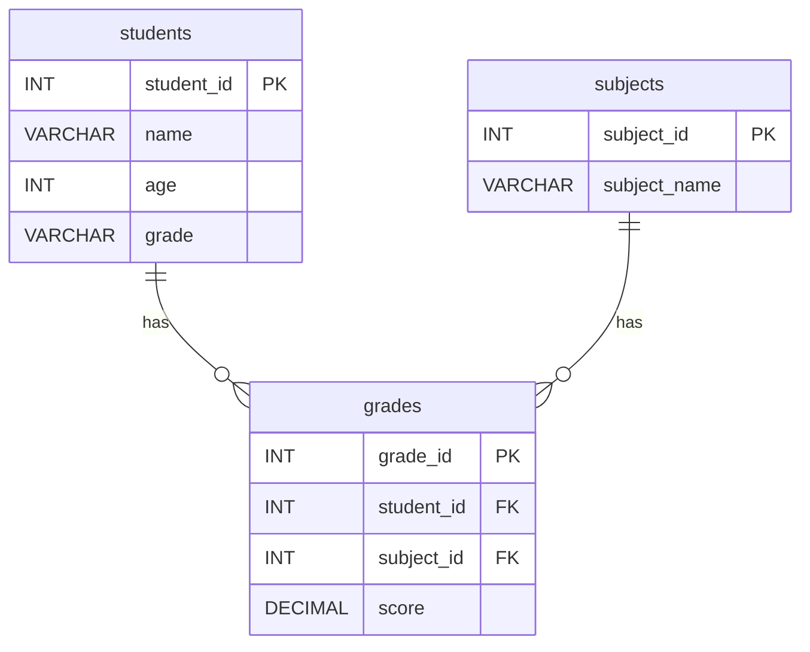

# students, subjects, grades 테이블 관계도

## 1. 관계도



## 2. 아주 쉽게 보는 구조

```text
students                    grades                      subjects
+-----------+              +-----------+               +-------------+
| student_id|<----------+  | grade_id  |               | subject_id  |
| name      |           +--| student_id|-------------> | subject_name|
| age       |              | subject_id|               +-------------+
| grade     |              | score     |
+-----------+              +-----------+
```

## 3. 표 형태로 보기

### students

| student_id | name  | age | grade |
|---|---|---:|---|
| 1 | Alice | 20 | A |
| 2 | Bob | 22 | B |

### subjects

| subject_id | subject_name |
|---:|---|
| 1 | Math |
| 2 | English |
| 3 | Science |

### grades

| grade_id | student_id | subject_id | score |
|---:|---:|---:|---:|
| 1 | 1 | 1 | 95.5 |
| 2 | 1 | 2 | 88.0 |
| 3 | 2 | 1 | 92.0 |

## 4. 관계 해석

- `students.student_id`는 `students` 테이블의 기본키입니다.
- `subjects.subject_id`는 `subjects` 테이블의 기본키입니다.
- `grades.student_id`는 `students.student_id`를 참조하는 외래키입니다.
- `grades.subject_id`는 `subjects.subject_id`를 참조하는 외래키입니다.

즉, `grades`는 학생과 과목을 연결하는 중간 테이블 역할을 합니다.

예를 들어 `grades` 테이블의 `(student_id=1, subject_id=2, score=88.0)`은  
학생 1번(Alice)이 과목 2번(English)에서 88점을 받았다는 뜻입니다.
